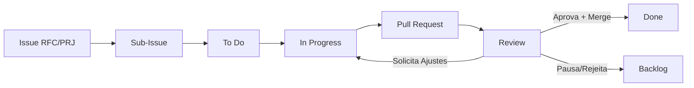

# Regras e Fluxo de Trabalho

**Objetivo:** Fluxo simples, assíncrono e rastreável. Foco em consistência, colaboração e entregas frequentes sem burocracia.

## Sincronização

Cada membro trabalha no próprio ritmo. A **segunda-feira** é o ponto preferencial para alinhar as prioridades da semana:

* **Prioridades:** Revisar PRs pendentes, atualizar tarefas em andamento e, por fim, iniciar novas atividades.
* **Fluxo contínuo:** Mesmo em semanas corridas, pequenas contribuições (um ajuste, um review) ajuda manter o projeto ativo.
* **Aprovação:** Todo PR exige aprovação de outro membro (Merge). PRs permanecem em Review até manifestação explícita.

## Regra de Ouro (Rastreabilidade)

**Sem Issue, sem código.** Toda alteração passa por este fluxo:

### 1. Issue Pai (O Projeto)

Representa o projeto e serve como agrupador. A descrição pode conter apenas o link direto para a documentação.

* Ideação: `[RFC] 001-nome-do-projeto`
* Execução: `[PRJ] 001-nome-do-projeto`

### 2. Sub-Issues (O Trabalho)

Toda atividade executável deve ser uma Sub-Issue. Utilize prefixos para facilitar a leitura:

* `[ADR]` Decisão de arquitetura ou design
* `[FEAT]` Nova funcionalidade
* `[FIX]` Correção de erro
* `[DOC]` Atualização de documentação
* `[CHORE]` Manutenção operacional
* `[REFACTOR]` Refatoração ou melhoria técnica

## GitHub Projects (Board)

* **In Progress:** Automático. Tarefa atualmente sendo desenvolvida (Atribua a você).
* **Review:** Automático. Código com PR aberto, aguardando aprovação.
* **Done:** Automático. (Use `Closes #ID_SUB_ISSUE` na descrição do PR).
* **To Do:** Manual. Para tarefas futuras ou pausadas temporariamente (Opcional).
* **Backlog:** Ideias e trabalhos sem prioridade imediata. Issues Pai (`[RFC]` e `[PRJ]`) ficam aqui por padrão.

## Documentação Viva

Cada projeto possui um único documento vivo `DESIGN.md` (ou `ARCHITECTURE.md`), que reflete o estado atual da solução.

1. **RFC:** Crie a Issue `[RFC] 001-nome` e o arquivo em `/docs/rfcs/`.
2. **PRJ:** Ao iniciar a execução, renomeie a Issue para `[PRJ] 001-nome` e mova o arquivo para `/projetos/001-nome/`.

## Visão Geral do Fluxo

